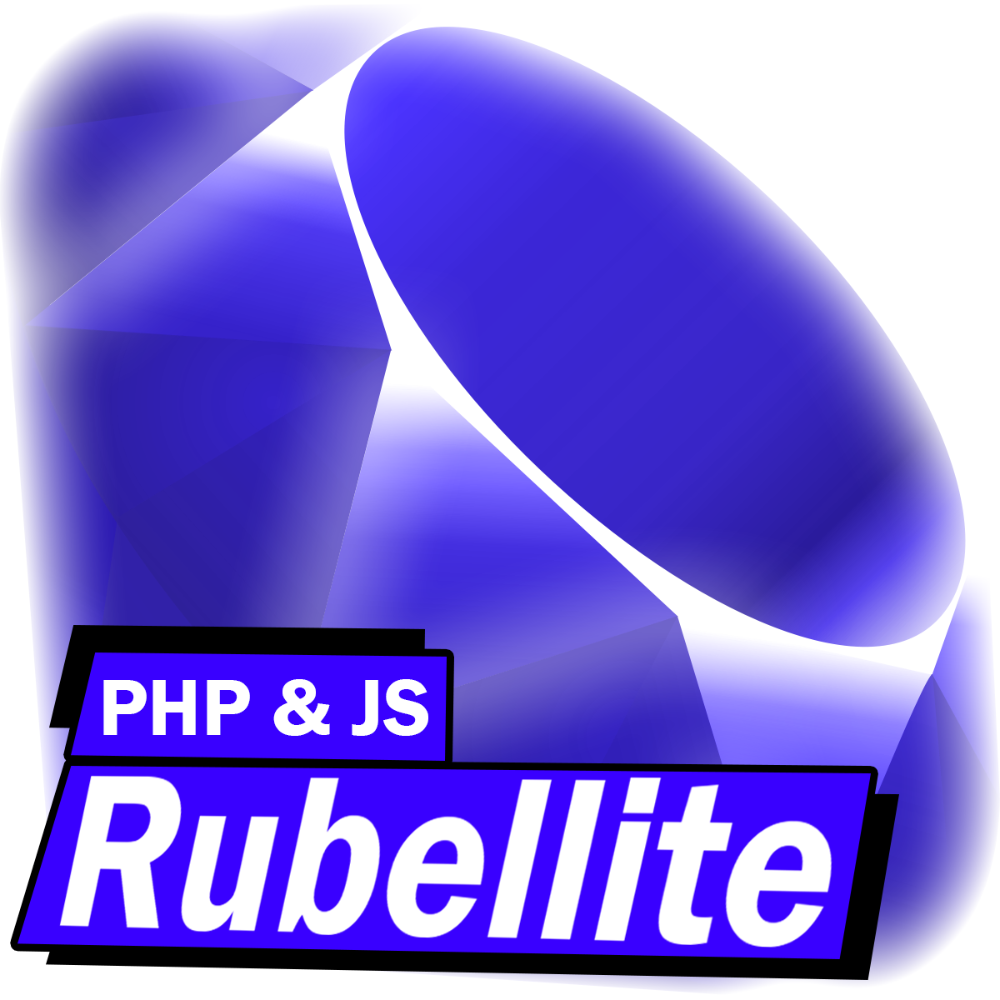

# Rubellite
a Simple PHP & JS library for building web applications.
Inspired by Laravel & Ruby on Rails.

### Installation
the installation is simple, just clone the repository.

### Configuration
Make sure the Root directory is set to the correct path.
* in some javascript files you can find the path to the root directory.
* in de config file you can find the path to the root directory.

Test it if it works.

### Development
The development is done in the following way:
* Create a new javascript file in the app/pages/ folder.
* Add is to the routes in the index.php file.
* Make sure the WebRender helper is used in the new file.

you can add optional controllers to the router insted of the WebRender helper.
And use the WebRender helper in the new Controller file.
